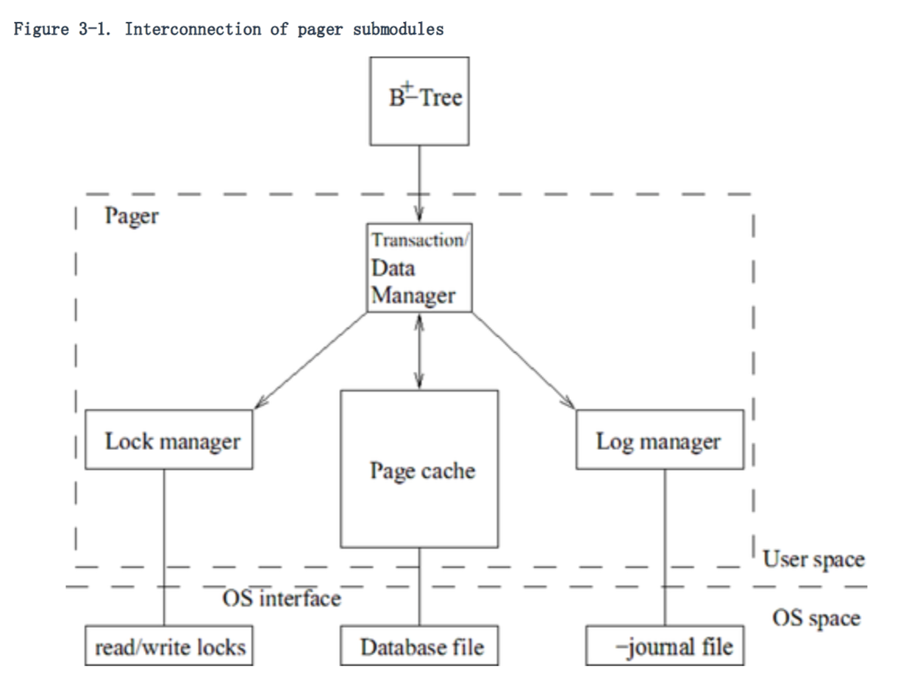

### 3.1 Pager 的主要任务

对于每个数据库文件来说，pager 作为缓存管理器，在文件和缓存中移动页（page）是它的基本功能。对于 B+ 树和更高层的模块来说，页的移动是透明的。pager 相当于本地文件系统和其他模块之间协调者。它的主要目的是使数据库页在内存中中可寻址，这样的话，其他模块就可以直接访问页的内容。它也会协调把页写会数据库文件。它把内存中的所有数据库文件都抽象成了页的一个数组。

除了缓存管理器的工作，pager 也实现了很多其他典型的 DBMS 函数。 它提供一个事务处理系统的核心服务：事务管理、数据管理、日志管理和锁管理。作为事务管理器，它通过并发控制和恢复实现了事务的 ACID 特性。它负责事务的原子提交（atomic commit）和回滚（rollback）。作为一个数据管理器，它协调数据库文件中 page 的读写，并且负责文件空间的管理。作为日志管理器，它决定是否将日志记录写入到日志文件中。作为一个锁管理器，它确保一个事务在访问数据库 page 之前，数据库文件上有相应的锁。简而言之，pager 模块实现了存储的持久性和事务的原子性。Pager 所有子模块之间的相互联系如图 3-1 所示。

**注意**

由于锁机制和日志管理机制，所有 pager 之上的模块都是完全隔绝的。实际上，它们不会察觉到锁和日志的活动。B+-tree 模块把所有事情都看做事务，它不需要关心事务的 ACID 特性是如何实现的。Pager 模块把事务活动分为对数据库文件的锁定（locking）、日志记录（logging）、读（reading）和写（writing）等操作。B+-tree 通过页码（page number）从 pager 中获取一页。反过来，pager 返回一个已经加载到页缓存中指向页数据的指针。再修改一个 page 之前，B+ 模块会通知 pager，这样 pager 就可以先保存足够的数据到日志文件中，以便将来恢复时使用，同时也可以获得数据库文件的锁。当B+-tree 使用完一个页的时候，它也会通知 pager；如果页被修改了，pager 就把修改后的页写回文件。
